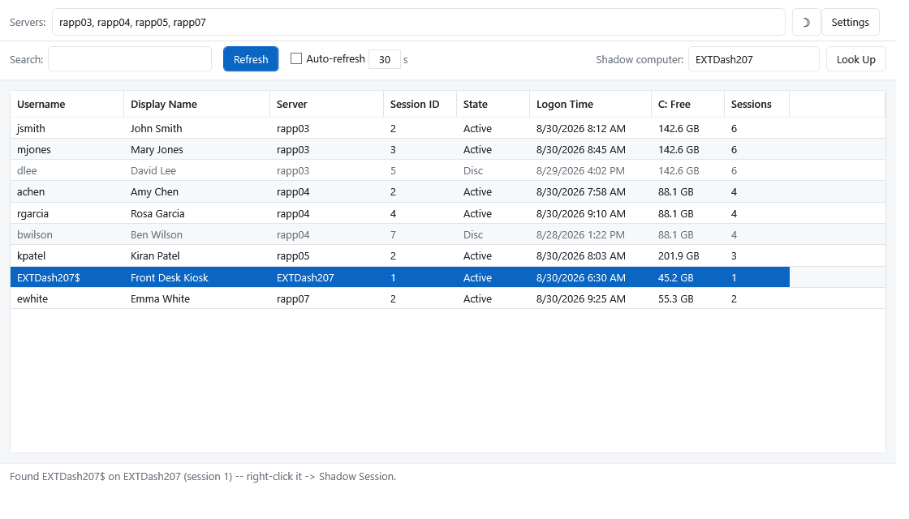
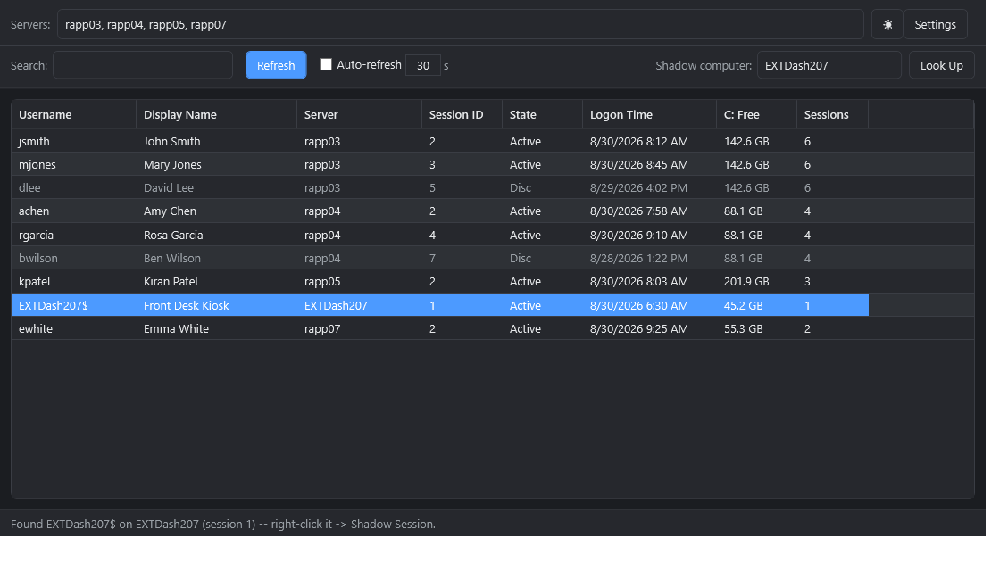
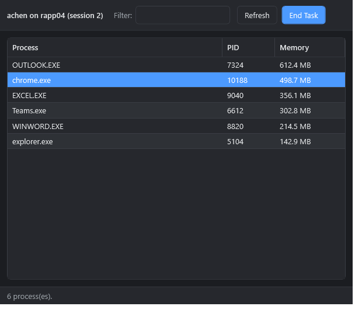

# Remote Session Manager

A modern WPF GUI for managing user sessions across many Windows RDS / terminal
servers (and individual workstations) from one place. Query who's logged on
where, then **shadow, connect, message, disconnect, log off, reset**, or drill
into a user's **running processes and end tasks** — all without leaving the app.

Single, self‑contained PowerShell script with inline XAML. Runs on Windows
PowerShell 5.1 (present on every Windows Server / desktop 2012 R2+); it
self‑elevates and relaunches under an STA host as needed.

## Features

- **Multi‑server session list** — parallel `quser` queries across all your
  servers (runspace pool, so it stays fast with a long list), plus C: free space
  and AD display names (cached).
- **Actions (right‑click a session):**
  - **View Processes…** — list that user's processes on that server (name, PID,
    memory) and **End Task** (single or multi‑select). 
  - **Shadow Session** — `mstsc /shadow` with view/control + consent options.
  - **Connect (RDP)** — `mstsc /v:`.
  - **Send Message** — `msg` to one or many sessions.
  - **Disconnect** / **Log Off** / **Reset** — with confirmation on the
    destructive ones.
- **"Shadow computer" box** — type any machine name (e.g. a workstation),
  **Look Up**, and its session drops into the grid ready to right‑click → Shadow.
- **Light / Dark theme** with a sun‑moon toggle (remembered between runs).
- **Auto‑refresh** toggle + interval, live **search** (username / display name /
  server / state), and sortable columns.

## Requirements

- Windows PowerShell 5.1 (Windows Server / desktop 2012 R2+).
- Run as an administrator with rights on the target servers (shadow, log off,
  reset, remote process control).
- Remote WMI/CIM uses **DCOM** (no WinRM required) — the same transport the
  classic RDS admin tools use.

## Usage

1. Download the latest release (or clone this repo) and extract it.
2. Copy `servers.example.txt` to **`servers.txt`** and list your machines
   (one per line). *Or* type server names into the **Servers** box at runtime.
3. Run **`Session-Manager.bat`** (it launches STA + bypass and self‑elevates).
4. Click **Refresh**.

> `settings.ini` stores your preferences (refresh‑on‑startup, default shadow
> options, auto‑refresh, theme). `scriptcache` holds cached AD display names and
> is created on first run. Both `servers.txt` and `scriptcache` are git‑ignored
> so your internal hostnames and usernames never end up in the repo.

## Credits & license

This is a rewrite of [DiadNetworks/Win‑Session‑Manager](https://github.com/DiadNetworks/Win-Session-Manager)
(originally WinForms). Licensed under the [MIT License](LICENSE); the original
copyright is retained per the license terms.
